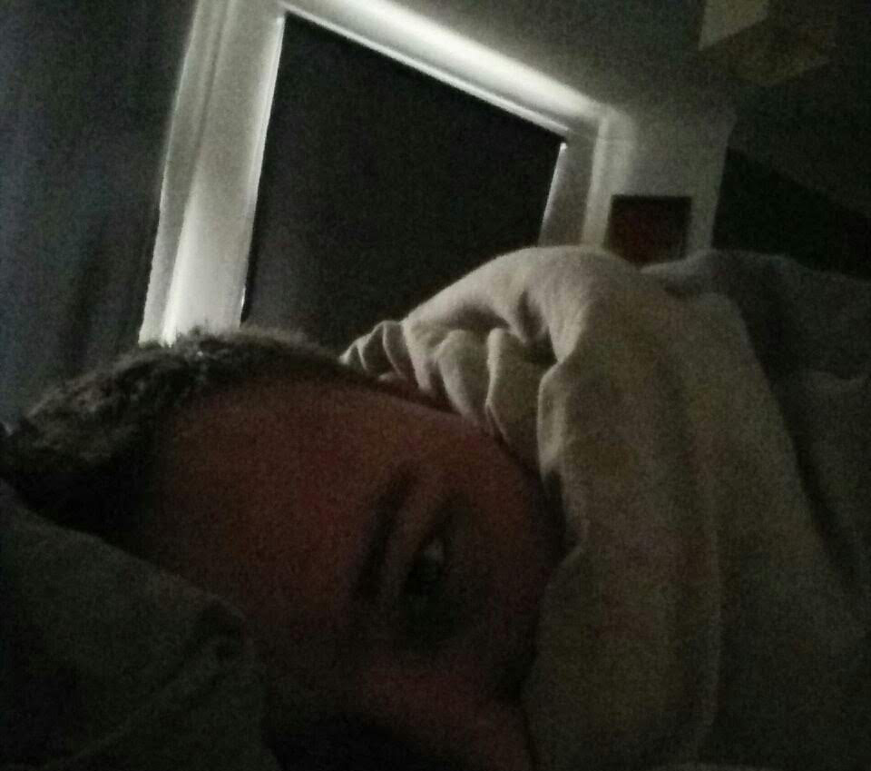
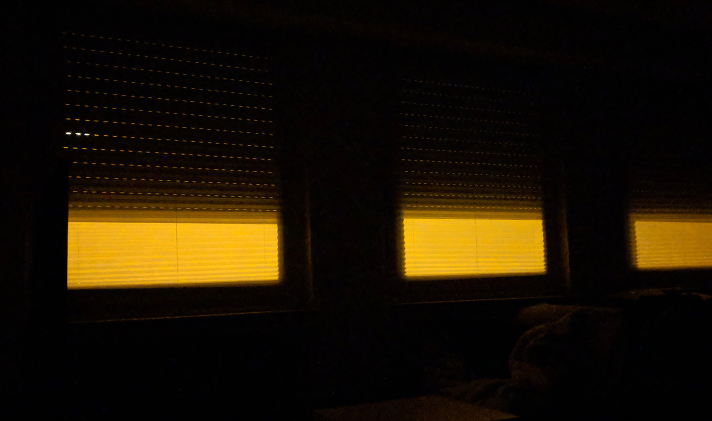

Als ich Ende 2016 nach Köln gezogen bin, hatte meine neue Wohnung ein großartiges Feature: Rollläden. Das war für mich sehr aufregend, weil ich endlich wieder in totaler Finsternis schlafen konnte.

Meine alte Wohnung in Gummersbach hatte nur Rollos von Ikea, die innen angebracht waren und an den Seiten trotzdem Licht durchgelassen haben. Ich habe das gehasst. Jeden morgen war mein Schlafzimmer in ein ungemütliches kaltes Licht gehüllt und hat mich aus dem Schlaf gerissen. Ich wollte auch nicht versuchen, ganz ohne Rollos zu schlafen, weil es eine Erdgeschosswohnung war und ich nicht wollte, dass irgendjemand von draußen in meine Wohnung schauen kann und mich im Bett liegen sieht. (Eine berechtigte Sorge, weil Leute ständig in meine Wohnung gespannt haben, wenn sie am Haus vorbei liefen.)

In meiner ersten Nacht in der Kölner Wohnung habe ich die Rollläden runter gemacht und mich wirklich gefreut. Ich hatte in dieser Nacht wunderbar geschlafen; wahrscheinlich, weil ich vom Umzug sehr erschöpft war, aber die Dunkelheit war fantastisch und auch die kommenden Nächte waren grandios und _dunkel_. Ich konnte so gut und vor allem so tief schlafen. Auch morgens bin ich nochmal in einen richtig tiefen Schlaf gefallen.

Ich habe morgens so tief geschlafen, dass ich nur sehr schwer aufstehen konnte. Ich hätte einfach immer weiter schlafen können.

Vor ein paar Wochen ist mir dann selbst aufgefallen, dass das dumm ist. Ich habe mich morgens gerädert gefühlt, kraftlos, ohne Motivation, und das wollte ich einfach nicht mehr. Ich möchte gerne früh und problemlos aufstehen können. Scheiß auf Schlaf: wenn man wach ist, geht das Leben ab.

Seit ein paar Wochen lasse ich meine Rollläden also mindestens auf Schlitz, meist ein drittel offen. Ihr fragt euch, wie ich damit klar komme? Ganz gut! Ich mag im Sommer nachts das orangene Licht von der Straße. Morgens geht mir das Sonnenlicht zwar noch auf den Sack, aber immerhin: ich schlafe morgens nicht mehr so tief, wache manchmal auch vor meinem Wecker auf und bin nicht mehr so müde. Verrückt, wie sich alle paar Jahre die eigenen Angewohnheiten ändern.
