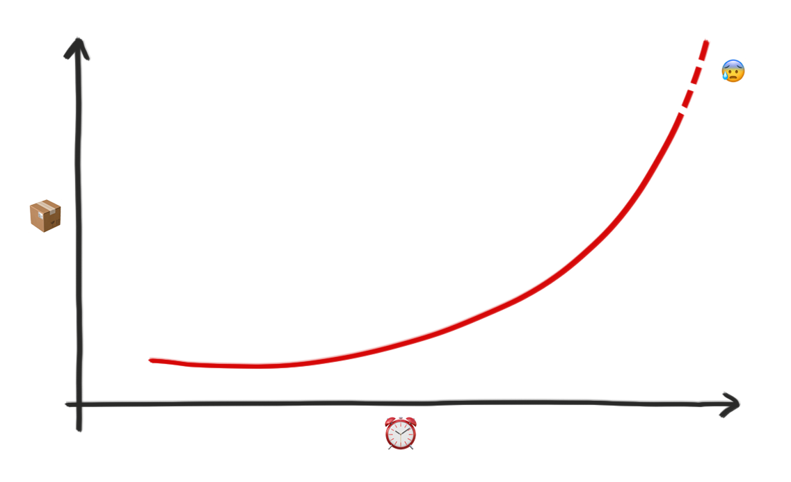

Gute Startup-Ideen lösen ein Problem, und ich habe ein ziemlich großes Problem: Kartons.

Ich bestelle viel bei Amazon. Wieso sollte ich auch quer durch Köln zu einem Elektrohändler fahren, mir dort einen Staubsauger kaufen und den zu mir nach Hause schleppen, wenn ich mir das gleiche mit nur einem Klick bis an die Wohnungstür liefern lassen kann.

Amazon liebt Verpackungen. Pakete sind in Paketen, welche wiederum in Paketen verpackt sind. Dazu noch viel von diesem braunen zerknüllten Papier und andere Platzfüller aus Pappe, damit die Pakete in den Paketen nicht herum rutschen und die Ware sicher transportiert werden kann. Sobald ich diese Papp-Matroschka ausgepackt habe, freue ich mich zwar über meinen neuen Staubsauger, habe jetzt aber noch zusätzlich einen Haufen Altpapier, den ich irgendwie entsorgen muss.

Meine Nachbarn bestellen auch viel bei Amazon. Unsere Papiertonnen sind ständig voll mit Amazon-Kartons. Aber Papiertonnen sind dafür gar nicht gemacht. Früher gab es nicht so viel sperriges Altpapier. Heute gibt es das massig, aber die Tonne ist die ganze Zeit gleich geblieben. Kartons müssen auseinandergerissen werden, weil ansonsten nur drei Stück in eine Tonne passen würden. Und manchmal fällt in einer einzigen Amazon-Lieferung so viel Altpapier an, dass ich auch kompakt und zerrissen immer noch fast eine ganze Tonne damit fülle.

> _"Aber Timo, wenn die Tonnen nicht mehr ausreichen, kannst du das dem Vermieter sagen und der bestellt dann mehr Tonnen."_

Ich bin davon überzeugt, dass weitere Tonnen das Problem nicht lösen. Ein gefalteter Karton will wieder zurück in seine Ursprungsform. Wenn meine Nachbarn einen Karton fröhlich in die Tonne stopfen, und die Pappe entfaltet sich darin wieder, räumt der nächste Hausbewohner garantiert nicht den Müll nochmal raus, um alles sauber und ordentlich wieder einzusortieren. Das ist kein Problem von meinen Nachbarn, ich mache nämlich bestimmt das Gleiche. Um eine Papiertonne effizient zu füllen, muss mit einigem Aufwand alles zerrissen werden – natürlich geht es hier auch um Gemütlichkeit.

**Die Lösung: hol meine Kartons ab, und ich bezahle dich dafür.**

<!-- more -->

Das ist mein voller Ernst. Komm mit einem Kleintransporter zu mir gefahren, lade meinen sperrigen Papiermüll ein, und ich bin ein glücklicher und wiederkehrender Kunde. Müll ist eine eklige Angelegenheit? Papiermüll nicht. Niemand ekelt sich vor Kartons. Aber ich bekomme jetzt schon Schweißperlen auf der Stirn, wenn ich nur daran denke, was ich mit all den Kartons zur Weihnachtszeit machen soll.

Der Online-Versand steigt von Jahr zu Jahr. Die KEP-Branche (Kurier-Express-Paket) ist eine der am stärksten wachsenden Branchen ([Quelle](https://www.biek.de/tl_files/biek/downloads/papiere/BIEK_KEP-Studie_2016.pdf#page=21)), weil wir uns jeden Scheiß liefern lassen. Mittlerweile hat Amazon sogar einen eigenen Lieferdienst, weil wir so viel bestellen, dass es finanziell einfach sinnvoller ist. Auf die Schnelle finde ich kein Diagramm für die Anzahl der versendeten Pakete über die letzten Jahre, und wenn ich eins finden würde, dürfte ich es garantiert nicht verwenden, aber ich stelle es mir ungefähr so vor:

Solltest du dich also dazu berufen fühlen und ein Altpapier-Abholservice-Startup gründen wollen, biete ich dir jetzt und hier an, **dass ich dir deine Onlinepräsenz komplett maßgeschneidert programmiere**, inklusive Buchung für den Kunden, Verwaltung für dich und was du sonst noch brauchst, um online starten zu können. Melde dich bei mir! (Google einfach meinen Namen, du wirst was passendes finden. Und mach bitte schnell, ich weiß nicht mehr wohin mit all den Kartons.)
