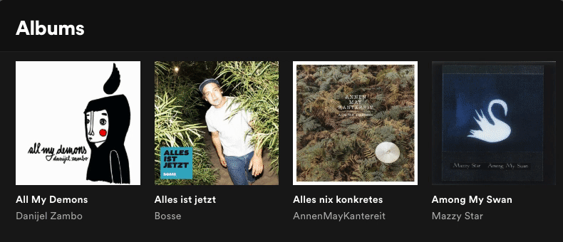
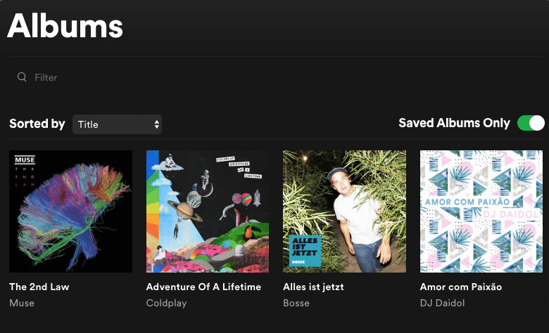

Vor ein paar Wochen habe ich angefangen die Library von Spotify zu nutzen. Davor habe ich Songs immer in meiner [Daily Mix Playlist](https://open.spotify.com/user/1121697740/playlist/5c3orjfOQtj1FlEd0ZD0kT) gespeichert, was ja eigentlich dumm ist, weil man in Spotify überall schnell einen Song zur Library hinzufügen kann. Deshalb habe ich alle Songs aus meiner Daily Mix Playlist in die Library geschoben und nutze seitdem die Library.

## Das Problem

Wenn mir nach Musik hören ist, stöber ich oft durch meine Alben oder Artists und höre etwas, nach dem mir gerade ist. Ich höre öfter ganze Alben durch, anstatt durch Playlists zu shufflen. Aber seitdem ich meine Songs aus der Daily Mix Playlist in die Library geschoben habe, ist meine Alben-Übersicht zu unübersichtlich geworden, weil dort jetzt allen Alben aufgelistet sind, die Songs beinhalten, die ich gespeichert habe. Das gleiche gilt für die Artists-Übersicht.

Dass die Library so funktioniert, weiß ich schon länger. Aber erst jetzt habe ich gemerkt, wie unbenutzbar die Library dadurch wirklich ist.

## Was Spotify falsch macht

<!-- more -->

In der Song-Übersicht finden sich jetzt neben meinen gespeicherten Songs auch alle Songs aus meinen gespeicherten Alben. Alle! Auf dem [letzten Bosse-Album](https://open.spotify.com/album/1xAUqAqWBUwPGRv7YJvP39) sind 8 Akustik-Versionen und 9 Live-Versionen von Songs, die gar nicht zu dem Album gehören. [Neuanfang von Clueso](https://open.spotify.com/album/6IaWqDs0ldptwVfTLhgGSK) gibt es nur in der Deluxe Edition, auf der insgesamt 29 Songs sind: das Album hat 10 Songs, dann gibt es jeden Song nochmal instrumental und 9 verschiedene andere Versionen. Wenn ich also geshuffled durch alle meine Songs höre, fängt manchmal ein Clueso-Song an und irgendwann bemerke ich, dass er nur instrumental ist.

Meist will ich in so einem Moment den Song gerne in seiner normalen Version hören. Dafür muss ich mich aber genervt durch die Spotify UI klicken. Das kommt auch oft vor, wenn ich im Auto sitze, aber mit Android Auto mal schnell den richtigen Song finden und in die Warteschlange packen ist eine schier unmögliche Aufgabe, vor allem wenn man gerade Auto fährt.

Wenn man in der Library auf ein Album oder einen Artist klickt, kommt man zu einer Übersicht der **gespeicherten Songs des Albums oder Artists** – entgegen allen UI-Patterns und Erwartungen, die Spotify in der App etabliert hat. Erst über einen Link kommt man dort hin, wo man hin will. Warum ist das ein eigener Screen, auf dem meist nur nur ein Song zu sehen ist? Warum ist das nicht einfach eine Sektion beim Artist oder Album?

Für Alben hat sich Spotify dann doch eine Lösung überlegt: ein Switch, mit dem nur tatsächlich gespeicherte Alben angezeigt werden, und nicht mehr alle möglichen Alben. Das wäre schonmal eine okaye Lösung, wenn Spotify 👏 nicht 👏 so 👏 unfähig 👏 wäre.

**Für Spotify ist alles ein Album, auch Singles.** Meine Alben sind trotz des Toggles immer noch zugemüllt mit Songs, die nur als Single erschienen sind, oder Songs, die ich als Singleauskopplung gespeichert hatte, bevor das Album erschienen ist. – Oder manchmal auch das Album und ein paar Singleauskopplungen daraus, wodurch ich auch Songs doppelt in der Library habe. Außerdem existiert der Toggle nur in der Desktop-App und nicht in der Android-App. Und dazu stellt sich mir die Frage: warum gibt es diesen Toggle nur bei Alben? WARUM NICHT BEI SONGS?

## Was ich will

In meiner Musiksammlung will ich einzelne Songs speichern, vergleichbar wie ich mir früher verschiedene mp3s auf meinen alten mp3-Player gezogen habe oder auf CD gebrannt habe. Die kann ich dann durchshufflen, wenn mir danach ist. Außerdem will ich Alben speichern, als würde ich mir ein physikalisches Album kaufen und in mein Regal stellen. Die Alben kann ich durchstöbern und finde eins, auf das ich Lust habe.

Spotify hatte die Starred-Playlist durch die Library abgelöst, damit man sich die heimische CD-Kollektion auch digital aufbauen kann. Aber eigentlich ist die Library nur die Starred-Playlist mit ein bisschen Gruppierung obendrauf. So will ich mir keine **Sammlung** aufbauen.

Wenn ich einen Song gut finde, heißt das nicht, dass ich das ganze Album mag. Und wenn ich ein Album gut finde, will ich nicht alle Songs des Albums in meinem Mixtape haben und geshuffled hören. In [Muse's _Drones_](https://open.spotify.com/album/2wart5Qjnvx1fd7LPdQxgJ) gibt es den Song _Drill Sergeant_, der einfach 21 Sekunden lang rumschreit, weil es eine Überleitung zum nachfolgenden Song ist. Alben sind Gesamtwerke. So einen Song will ich aber nicht in meiner Songkollektion haben, weil er ohne Zusammenhang einfach nur sinnlos ist.

Argh. So bringt das alles nichts. Ich nutze jetzt wieder meine Daily Mix Playlist und muss mal meine Library aufräumen, damit ich sie wenigstens für Alben nutzen kann.
